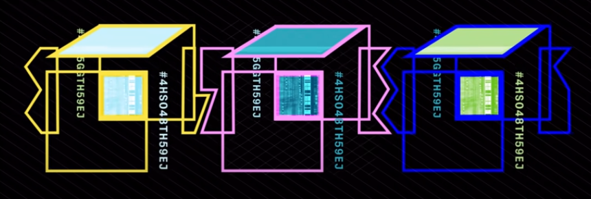
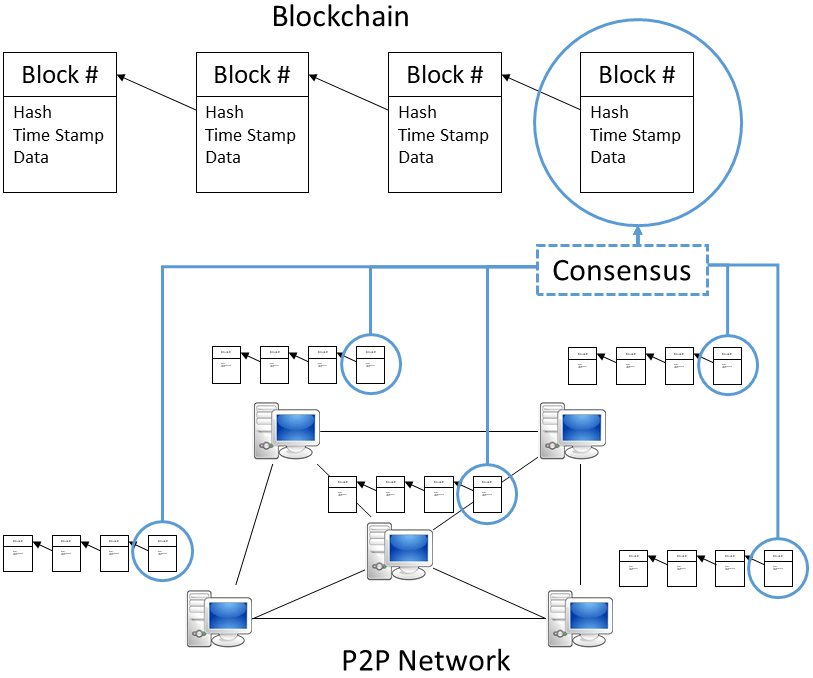
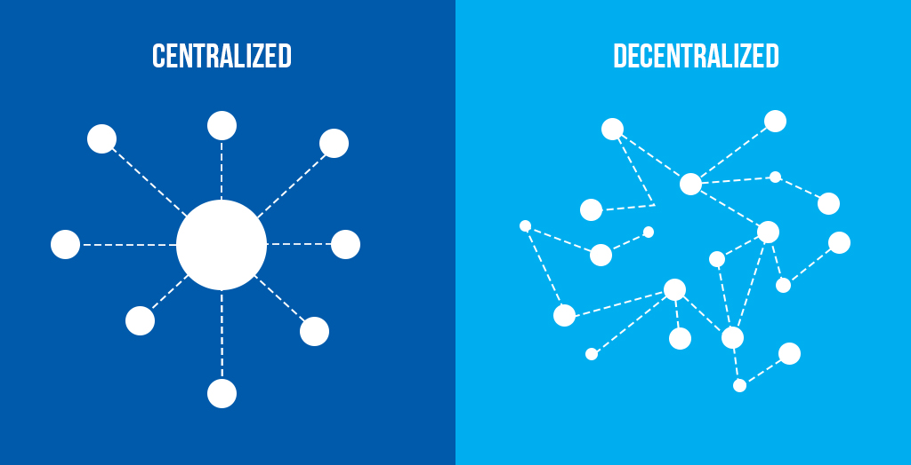

# Blockchain
they have information, hash (block identidication) and previous hash block (with this each block is connected with the others blocks), it's a decentralized architecture.
<br />
 <br />
 <br />
 <br />


## Public
Without the need to do permission (Permissionless), such as, Bitcoin, Ethereum or Litecoin

## Private
administrator, it is hanldered by a business.
This business allows that who are the nodes, some examples are: Ripple or Hyperledger

## Consortium
Controlled by a group of entities or organizations instead of an only entity, more descentrillecer and more security, but it needs more organization coperation.

```
Las cadenas de bloques de consorcio son cadenas de bloques autorizadas y gobernadas por un grupo de organizaciones, en lugar de una entidad, como en el caso de la cadena de bloques privada. Las cadenas de bloques de consorcio, por lo tanto, disfrutan de una mayor descentralización que las cadenas de bloques privadas, lo que da como resultado niveles más altos de seguridad. Sin embargo, la creación de consorcios puede ser un proceso tenso, ya que requiere la cooperación entre varias organizaciones, lo que presenta desafíos logísticos, así como un posible riesgo antimonopolio. Además, es posible que algunos miembros de las cadenas de suministro no tengan la tecnología ni la infraestructura necesarias para implementar las herramientas de cadena de bloques, y aquellos que la tengan pueden decidir que los costos iniciales son un precio demasiado elevado para digitalizar sus datos y conectarse con otros miembros de la cadena de suministro. 

La firma de software empresarial R3 ha desarrollado un popular conjunto de soluciones de cadena de bloques de consorcio para la industria de servicios financieros y más allá. En el sector de la cadena de suministro, CargoSmart ha desarrollado el Global Shipping Business Network Consortium, un consorcio de cadena de bloques sin fines de lucro que tiene como objetivo digitalizar la industria del transporte marítimo y permitir que los operadores de la industria marítima trabajen de manera más colaborativa.
```

## Hybrid
```
Las cadenas de bloques híbridas son cadenas de bloques controladas por una sola organización, pero con un nivel de supervisión realizado por la cadena de bloques pública, que se requiere para realizar ciertas validaciones de transacciones. Un ejemplo de cadena de bloques híbrida es IBM Food Trust, que se desarrolló para mejorar la eficiencia en toda la cadena de suministro de alimentos.
```
 <br />

## Hash
it is a block id, but there are many eyes see this. The hash is created with the block content, if the block contect is changed the hash will be changed too.
<br />
If this happen (hash change), this blok won't be connected with the others.
<br />
There is not a unique databases, each user has a copy of then.
<br />
If a user change his copy the community knows it.
<br />
The Miners perform the new blocks creation.

# Remix IDE
it is an online IDE: https://remix.ethereum.org/

```
HTTP vs HTTPS

Be careful with the https vs http domain. Remix stores edited files in localstorage of the browser. If your smart contracts are suddenly gone, look at the protocol.

In this course we work with http, not https. This is especially important later when we do private blockchains which require CORS to be setup correctly.
```

https://ethereum-blockchain-developer.com/2022-01-remix-introduction/01-setup-remix/